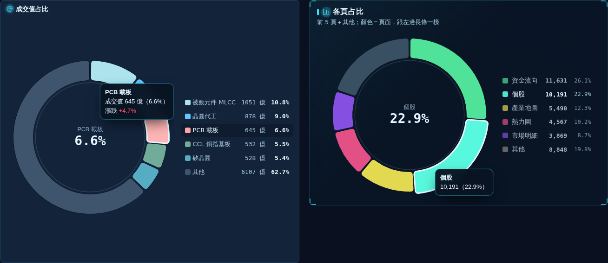
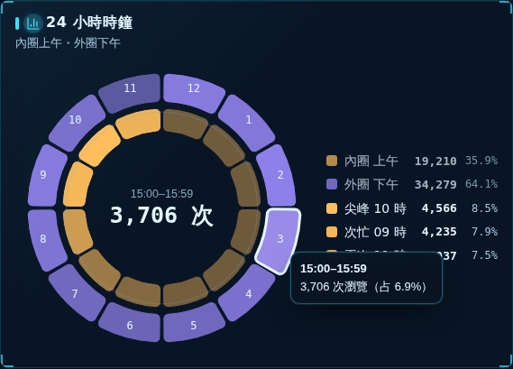
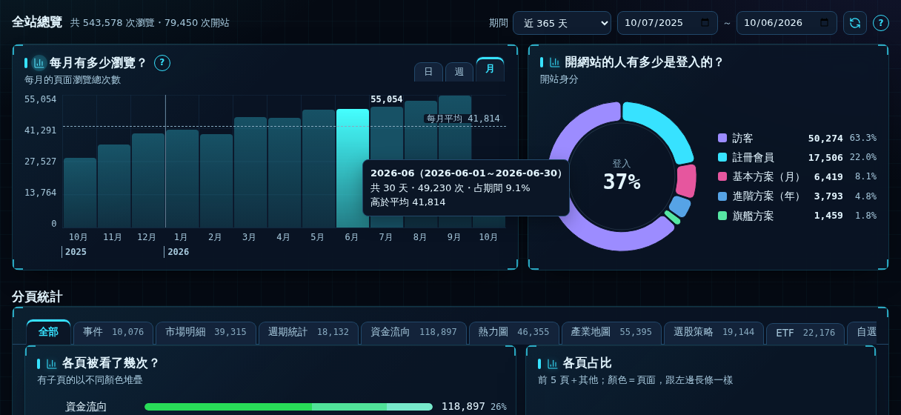
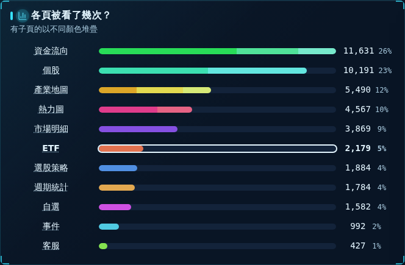
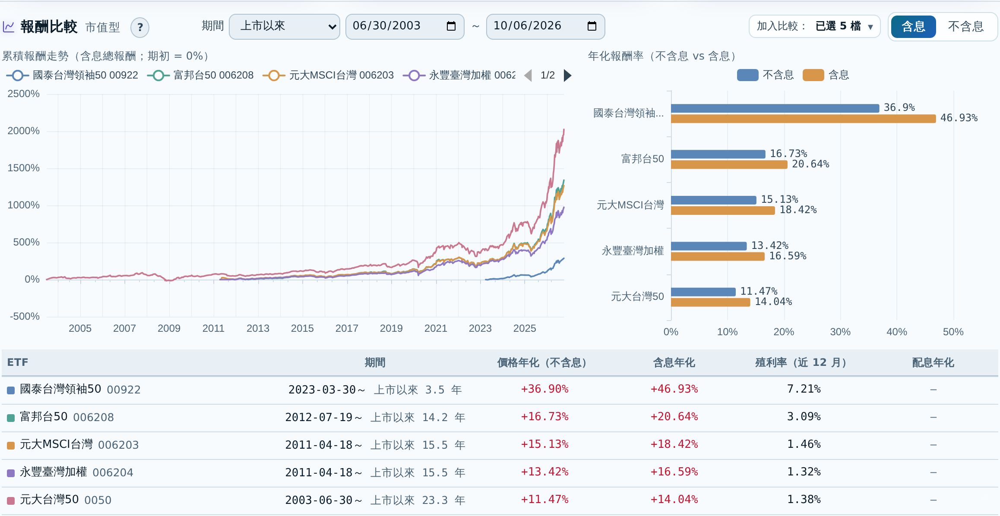

# 圖表庫（Andy 說「圖表庫」→ CEO 原樣列出本檔＋附圖）

每一款都有：**代號 → 範例圖 → 長相 → 滑過 → 點擊 → 可直接複製給新環境 Claude 的一段話**。
在本專案內只要說「用 A 款」；在全新環境，把該款最後那段「複製用」整段貼上。
範例圖在 `docs/chart_library/`（測試環境示範資料截圖）。實作的共用設定見 `docs/style_guide.md` 第十一～十三節。

---

## A 款甜甜圈（成交值占比款）

（左：產業地圖成交值占比，右：管理區各頁占比，兩張同款）

- **長相**：單圈環，內徑 68%、外徑 92%；前 5 大＋其他共 6 塊，「其他」灰色；扇區間白色細縫＋圓角 6px；圖例在右（色塊／名稱／數值／%）；中心小標約 12px＋大數字約 28px，字不超出內圈。
- **滑過**：該塊外凸 4px＋3px 外框，其他塊維持原色不變暗；中心字換成該塊名稱與 %；提示框在環外側、不擋中心字與圖例；滑過圖例也讓對應扇區強調。
- **點擊**：點某塊 → 切到該類明細；被點的塊維持強調，點別處取消；「其他」不跳頁，提示框列出內含項目；手機第一下＝提示、第二下＝執行。
- **複製用**：
  > 做一個 ECharts 甜甜圈圖：內徑 68%、外徑 92%，扇區間 1° 白縫、圓角 6px；只顯示前 5 大＋「其他」（灰色）；圖例在右列出色塊、名稱、數值、百分比；中心兩行字（小標 12px 灰、大數字 28px 粗，不超出內圈）。滑過：該扇區外凸 4px、加 3px 外框，其他扇區不變暗，中心字換成該扇區名稱與百分比，提示框放在環外側不擋中心字。滑過圖例同步強調。點擊扇區下鑽到該類明細並保持選取強調，「其他」點了只在提示框列內含項目；手機第一下顯示提示、第二下才執行。

## B 款時鐘環（24 小時時鐘款）

- **長相**：12 小時錶面、頂端 12／0、順時針；內圈 00:00–11:59、外圈 12:00–23:59，同鐘點上下午對齊；每格同大小，顏色深淺＝用量；外圈格內標 12、1…11；圖例「內圈上午／外圈下午／尖峰／次忙／再次」。
- **滑過**：同 A 款；中心換成「HH:00–HH:59／N 次」；提示框避開內圈與圖例。
- **點擊**：點某格 → 下方圖表只看那一小時，標題旁出現「15:00–15:59 ×」膠囊；再點或按 × 取消。
- **複製用**：
  > 做一個 24 小時使用時鐘：兩個同心 ECharts pie（內圈 12 格＝00–11 時、外圈 12 格＝12–23 時，頂端 12、順時針），每格同大小、用顏色深淺表示用量。中心預設寫尖峰時段，字縮到不超出內圈。互動同 A 款甜甜圈：滑過那格外凸加外框、其他不變暗、中心換成「HH:00–HH:59／N 次」、提示框在環外側且不蓋圖例。點某格篩選下方圖表只看該小時，標題旁出現可按 × 取消的膠囊。

## C 款直條（時間序列直條款）

- **長相**：單色漸層直條（上深下淺）；水平格線極淡；平均值虛線；只標最高那根的數字；每根之間極淡垂直分隔線；橫軸兩列（第一列每格標月份／日期、第二列只在跨年標年份＋年線）；卡片右上「日｜週｜月」週期鈕，預設依期間自動（≤31 天日、≤120 天週、更長月）。
- **滑過**：該條加亮＋2px 外框，其他維持原色；提示框寫完整起訖日期、數值、占比，放在直條上方不蓋刻度。
- **點擊**：點某根 → 下方其他圖換成那一天／週／月的統計；被選那根換強調色（琥珀）；標題旁「起～訖 ×」膠囊，按 × 或再點同根取消；手機第一下提示、第二下選取。
- **複製用**：
  > 做一個時間序列直條圖：單色漸層（上深下淺）、極淡水平格線、平均值虛線、只標最高值、每根之間極淡垂直分隔線。橫軸兩列：第一列每格標月份或日期，第二列只在跨年處標年份並畫年線。右上放「日｜週｜月」分頁式切換鈕，預設依期間長短自動選。滑過：該條加亮加 2px 外框，其他維持原色，提示框寫完整起訖日期、數值、占比。點某根：其他圖表篩成該段期間，該根換強調色，標題旁出現可按 × 取消的日期膠囊。

## D 款橫條（排行橫條款）

- **長相**：圓角橫條＋極淡底軌；可分段疊色（同色系＝子項）；左側名稱完整不截斷；右側數值＋百分比。
- **滑過**：同 C 款（該條加亮＋外框、其他維持原色、提示框）。
- **點擊**：點某條 → 進該項明細；分段疊色時點到哪段進哪個子項。
- **複製用**：
  > 做一個排行橫條圖：圓角橫條、極淡底軌、可同色系分段疊色表示子項；名稱在左且不可截斷，右側寫數值與百分比。滑過該條加亮加外框、其他維持原色並出現提示框。點擊某條（或某段）進入該項目明細。

## E 時間軸格線（所有時間橫軸圖共用）

- **長相**：每月一條極淡垂直線、每年一條稍明顯（約月線 1.6 倍）；線寬 1 實體像素；淡灰不准彩色；期間越長年線越淡（20 年以上減半）；≤2 個月改週線、盤中改交易日線；月資料／季資料只畫年線。
- **複製用**：
  > 所有以時間為橫軸的圖，背景加垂直分隔線：每月一條極淡線、每年一條稍明顯的線（約月線 1.6 倍），線寬 1 個實體像素、淡灰色、不准彩色；期間很長時年線再調淡；期間 2 個月內改每週一條。

## 週期鈕

- **長相**：貼在卡片右上的分頁式按鈕（segmented tabs），例如「日｜週｜月」「1H｜4H｜6H｜12H｜白天｜夜晚」。
- **行為**：點了立即重畫；不記憶，重新整理回預設。

## 通用點擊規則（每一款都適用）
- 可點的圖形滑過時游標變手指。
- 點下去要有立即可見的選取狀態，不能只換頁卻看不出點了哪個。
- 一定要能取消：× 膠囊、再點一次、或點空白處。
- 手機：第一下＝提示、第二下＝執行；點圖外面收起提示。
